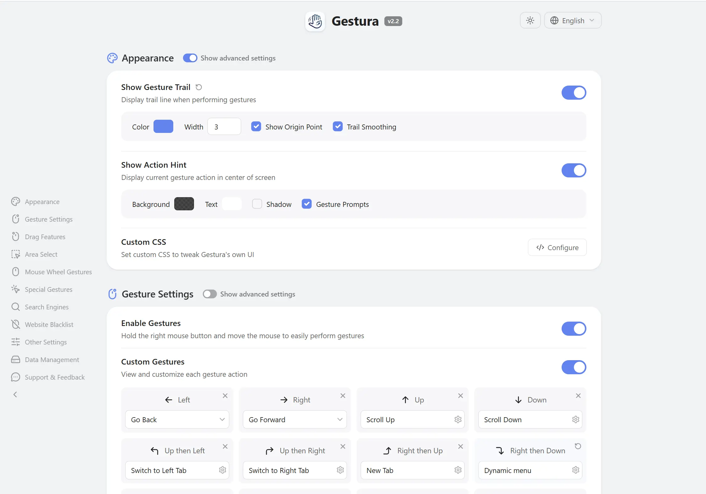

<div align="center">

<h1> Gestura</h1>

[](https://github.com/PPP01/Gestura)
[](https://github.com/PPP01/Gestura/releases)
[](https://github.com/PPP01/Gestura/blob/main/LICENSE)

[English](README.md) · **Deutsch**

Gestura ist eine Open-Source-Erweiterung, die kurze Mausbewegungen in Browser-Befehle verwandelt — eine Geste zeichnen, einen Link oder etwas Text ziehen, kurz am Rad drehen, und die Aktion passiert sofort, ganz ohne Tastatur.

Gesten-Navigation, smarte **Website-Menüs** pro Seite, Super-Drag, Bereichsauswahl, Rad- und Rocker-Gesten sowie Befehlsketten — alles davon kannst du anpassen.
</div>

> ### 🙏 Gestura ist ein Fork von [FlowMouse](https://github.com/Hmily-LCG/FlowMouse)
>
> **Zuerst das Wichtigste: Gestura gäbe es nicht ohne [FlowMouse](https://github.com/Hmily-LCG/FlowMouse) von Hmily\[LCG] & Coxxs.** Gestura ist ein freundlicher Fork, der **nur** deshalb existiert, um eine Handvoll Zusatzfunktionen mitzubringen — smarte Website-Menüs pro Seite, konfigurierbare Suchmaschinen, Bildersuche und JavaScript-Transformationen pro Link —, die es nicht in FlowMouse geschafft haben (dessen Autoren wollen es bewusst leichtgewichtig halten).
>
> **Ganz herzlichen Dank an die Original-Autoren für diese großartige Erweiterung.** Wenn du die Zusatzfunktionen nicht brauchst, nutze und unterstütze bitte das Original: **[FlowMouse](https://github.com/Hmily-LCG/FlowMouse)**. Gestura bleibt Open Source unter derselben GPL-3.0-Lizenz.

<div align="center">
<br>

</div>

## Installation

Die Store-Einträge sind in Vorbereitung. Bis dahin kannst du aus dem Quellcode oder aus den Release-Dateien installieren:

> Von den [GitHub Releases](https://github.com/PPP01/Gestura/releases) herunterladen und manuell laden, oder das Repo klonen und als entpackte Erweiterung laden (`chrome://extensions` → Entwicklermodus → *Entpackte Erweiterung laden*).

## Funktionen

Mit Gestura wird die Maus, die du ohnehin in der Hand hast, zur Abkürzung für fast alles beim Surfen: Tabs wechseln, vor und zurück, markierten Text suchen, Links stapelweise öffnen und mehr — jeweils auf eine Bewegung deiner Wahl gelegt.

### Alles, was FlowMouse kann

Gestura bringt den **kompletten FlowMouse-Funktionsumfang** mit — nichts wurde entfernt:

- **Eigene Gesten** — 16 vorkonfigurierte Gesten, dazu beliebig viele selbst definierte.
- **Super-Drag** — Text, Links oder Bilder ziehen und damit sofort eine Aktion auslösen.
- **Rad-Gesten** — rechte Maustaste halten und scrollen, um Tabs zu wechseln.
- **Rocker-Gesten** — eine Maustaste halten und die andere klicken für Zurück/Vorwärts.
- **Bereichsauswahl** — Shift + Ziehen, um viele Links auf einmal zu öffnen oder zu kopieren.
- **Befehlsketten** — mehrere Aktionen aus einer einzigen Geste.
- **Einstellungen & Tutorial** — Gestenspur, Aktionshinweise und mehr in einer aufgeräumten Oberfläche anpassen; interaktive Einführung bei der ersten Installation.

### ✨ Was Gestura hinzufügt

Der Grund, warum Gestura existiert — die Zusatzfunktionen, die es nicht in FlowMouse geschafft haben:

- **Website-Menüs — Gesturas Kernfunktion.** Fertige, voll editierbare Popup-Menüs für die Seiten, die du täglich nutzt: GitHub, YouTube, Amazon (mit Länderauswahl), Gmail, Google Maps, Microsoft 365, Facebook, Reddit, Wikipedia und mehr — jeder Eintrag mit passendem Icon. Eine Kontext-Geste öffnet auf jeder Seite das richtige Menü; ein Standard-**Suchmenü** (Google, Brave, Perplexity, DuckDuckGo …) deckt alles andere ab, und ein **Shopping**-Menü (Amazon, eBay, …) sucht deine Auswahl dort, wo du kaufst.
- **Menüs, die deine bleiben** — jedes vordefinierte Menü global bearbeiten, oder es als angepasste Kopie in eine einzelne Geste laden, die für die unveränderten Einträge weiterhin künftige Verbesserungen erbt. Private Menüs pro Geste, eine optionale Mini-Suchleiste unten an jedem Menü, Sichtbarkeit im Menü-Umschalter pro Menü und konfigurierbares Link-Öffnen (im selben Tab oder in einem neuen Tab links/rechts/am Anfang/am Ende) — global und pro Menü.
- **Konfigurierbare Suchmaschinen** — eigene Text- **und** Bild-Suchmaschinen hinzufügen, sortieren und ausblenden, mit sinnvollen Voreinstellungen je Sprache; die aktuelle Website mit einem Wisch in ein Menü aufnehmen.
- **Bildersuche** — eine Rückwärtssuche für Bilder ziehen oder aufrufen, auf den Suchmaschinen deiner Wahl.
- **JavaScript-Transformationen pro Link** — den markierten Text mit einem kleinen, isolierten JS-Snippet umformen, bevor er an eine Such-URL übergeben wird (fortgeschritten, läuft getrennt von der Seite und von der Erweiterung).

## Standard-Gesten

Alle Gesten lassen sich auf der Optionsseite anpassen.

| Geste | Funktion | Geste | Funktion |
|:---:|:---|:---:|:---|
| `←` | Zurück | `→` | Vorwärts |
| `↑` | Nach oben scrollen | `↓` | Nach unten scrollen |
| `↑←` | Zum linken Tab wechseln | `↑→` | Zum rechten Tab wechseln |
| `→↑` | Neuer Tab | `→↓` | Aktuellen Tab aktualisieren |
| `↓←` | Laden stoppen | `↓→` | Tab schließen |
| `←↑` | Geschlossenen Tab wiederherstellen | `←↓` | Alle Tabs schließen |
| `↑↓` | Zum Ende scrollen | `↓↑` | Zum Anfang scrollen |
| `←→` | Tab schließen | `→←` | Geschlossenen Tab wiederherstellen |

## Für Website-Betreiber

Eine Website kann der Erweiterung ein fertiges Gestura-Menü oder eine Suchmaschine
übergeben. Nichts wird stillschweigend importiert: jede Übergabe verlangt einen
echten Nutzerklick, die Daten werden gegen das Austauschformat geprüft, und der
Nutzer bestätigt sie in einem Vorschaudialog. Suchmaschinen mit
Transformations-Skript brauchen eine eigene, ausdrückliche Zustimmung.

**Der Nutzer muss zuerst zustimmen.** Übergaben funktionieren nur, solange der
Nutzer in den Gestura-Einstellungen die *gestura.eu-Integration* eingeschaltet hat –
sie ist standardmäßig aus. Solange sie aus ist, ignoriert Gestura den Klick
vollständig: Einem `rel="gestura-menu"`-Link folgt der Browser einfach (also auf
eine URL zeigen, die sich sinnvoll öffnen lässt), und ein Inline-Button tut
nichts Gestura-Bezogenes (also einen normalen Download als Fallback anbieten).
Gestura verrät der Seite nicht, ob die Integration eingeschaltet ist.

**Per Link, für JSON, das du selbst hostest.** Das `href` des Links muss
same-origin zur Seite sein. Die Erweiterung folgt beim Abruf dieser URL
Weiterleitungen, ein same-origin-Link kann also am Ende von einer anderen
Origin ausgeliefert werden; die Herkunft richtet sich nach der letzten URL,
nicht nach der im Link geschriebenen.

```html
<a rel="gestura-menu" href="/gestura-menu.json">Zu Gestura hinzufügen</a>
```

**Inline, für Daten auf einer anderen Origin.** Ein vertrauenswürdiger Klick auf ein
Element mit `data-gestura-inline` öffnet ein 15-Sekunden-Fenster für die Übergabe.
Setze das Attribut auf den Button selbst, nicht auf einen umgebenden Container —
ein Klick auf ein beliebiges Kindelement bekommt seine Standardaktion unterdrückt,
ein Attribut auf Karten- oder Zeilenebene bricht also stillschweigend jeden Link
darin. Hole die Daten selbst — es gelten die üblichen CORS-Regeln, die Erweiterung
ist nicht beteiligt — und schicke sie als **String**:

```html
<button data-gestura-inline>Zu Gestura hinzufügen</button>
<script>
document.querySelector('[data-gestura-inline]').addEventListener('click', async () => {
	const res = await fetch('https://api.example.com/bundle', { /* … */ });
	document.dispatchEvent(new CustomEvent('gestura:import', {
		detail: JSON.stringify(await res.json()),
	}));
});
</script>
```

Das Fenster nimmt genau eine Sendung an und schließt beim ersten Eintreffen. Auf
diesem Weg stellt die Erweiterung keine eigene Anfrage.

**Datenformate.** Ein einzelnes `gesturaMenu`- oder `gesturaEngine`-Objekt, oder ein
Bündel daraus:

```json
{ "gesturaBundle": 1, "entries": [ { "gesturaMenu": 1, "…": "…" } ] }
```

Grenzen: 100 KB pro Eintrag, 1 MB pro Bündel, 200 Einträge — das sind die Grenzen der
Übergabe; was tatsächlich hineinpasst, hängt zusätzlich am Sync-Speicherkontingent
des Browsers.

**Menüs, die deine eigene Suchmaschine nutzen, müssen sie mitliefern.** Ein Menüeintrag
darf über `engineId` auf eine Suchmaschine zeigen, statt eine URL zu tragen. Das ist
ideal für die Suchmaschinen, die Gestura schon mitbringt — sie kosten nichts und
folgen den eigenen Einstellungen des Nutzers. Eine `engineId`, die eine Suchmaschine
benennt, die der Nutzer nicht hat, lässt sich aber nicht auflösen; die Erweiterung
verweigert dann den Import dieses Menüs und nennt die fehlende Suchmaschine. Lege die
`gesturaEngine` in dasselbe Bündel wie das Menü, das sie braucht. Jede URL innerhalb
eines Eintrags muss `https:` sein. Der vollständige Vertrag steht in
`js/exchange-schema.json`; maßgeblich ist der Validator zur Laufzeit in
`js/menu-exchange.js`.

## Datenschutz

Gestura ist eine Open-Source-Erweiterung. Der Code liegt auf GitHub und steht für
Einsicht und Beiträge offen.

- Gestura **erfasst keinen** Browserverlauf, keine Lesezeichen und keine Nutzungsgewohnheiten.
- Gestura **enthält keinen** Analyse- oder Werbe-Code.
- Gestura **lädt keine** lokalen Daten auf fremde Server.

Gesturas Einstellungen werden lokal über die Storage-API des Browsers gespeichert. Ist die Browser-Synchronisierung aktiv (z. B. Chrome Sync, Firefox Sync), verschlüsselt und synchronisiert der Browser die Einstellungen zwischen deinen angemeldeten Geräten. Dieser Vorgang liegt vollständig beim Browser und folgt dessen Datenschutz- und Sync-Einstellungen.

### Hinweis zu Brave

**Brave synchronisiert Erweiterungs-Einstellungen nicht zwischen Geräten, auch nicht mit aktivem Brave Sync.** Das ist eine Einschränkung von Brave selbst, nicht von Gestura. Brave betreibt eine eigene, selbst gehostete Sync-Infrastruktur (Brave Sync v2), die bewusst nur einen Teil der Browserdaten abdeckt — Lesezeichen, Verlauf, Passwörter, offene Tabs, die Liste installierter Erweiterungen und so weiter. Der Datentyp *Erweiterungs-Einstellungen* (der Speicherbereich, den Gestura über `chrome.storage.sync` nutzt) ist nicht dabei, und es gibt keine API, über die eine Erweiterung ihn anfordern könnte.

Deine Einstellungen werden auf jedem Brave-Gerät trotzdem gespeichert und bleiben erhalten — sie wandern nur nicht automatisch auf deine anderen Geräte. Solange Brave das nicht nachliefert, ist **Export** und **Import** auf der Optionsseite der einfachste Weg, deine Konfiguration zwischen Geräten zu bewegen: auf einem Gerät in eine Datei exportieren und diese auf dem anderen importieren.

Die vollständige Datenschutzerklärung steht in [PRIVACY.md](PRIVACY.md).

## Änderungsprotokoll

Siehe [CHANGELOG.md](https://github.com/PPP01/Gestura/blob/main/CHANGELOG.md).

---

**Gestura · Flüssiger surfen, mühelos steuern.**

---

### Danksagung & Autoren

- **Gestura-Maintainer**: PPP01 — [contact@gestura.eu](mailto:contact@gestura.eu)
- **Gestura auf GitHub**: [https://github.com/PPP01/Gestura](https://github.com/PPP01/Gestura)
- **Basiert auf FlowMouse von**: Hmily [LCG] & Coxxs — [https://github.com/Hmily-LCG/FlowMouse](https://github.com/Hmily-LCG/FlowMouse)
- **Lizenz**: GPL-3.0 (wie das Original). Gestura ist eine veränderte Version von FlowMouse; siehe [LICENSE](LICENSE) und [NOTICE](NOTICE).
- Rückmeldungen und Vorschläge sind willkommen.
