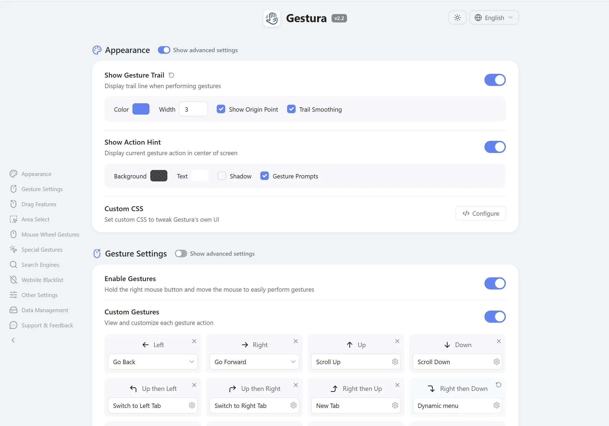

<h1> Gestura</h1>

Gestura is an open-source extension that turns quick mouse movements into browser commands — draw a gesture, drag a link or some text, flick the wheel, and the action happens right away, no keyboard needed.

Gesture navigation, super drag, area selection, wheel and rocker gestures, command chains, and per-site search menus — all of it is yours to customize.

> ### 🙏 Gestura is a fork of [FlowMouse](https://github.com/Hmily-LCG/FlowMouse)
>
> **First and foremost: Gestura would not exist without [FlowMouse](https://github.com/Hmily-LCG/FlowMouse) by Hmily\[LCG] & Coxxs.** Gestura is a friendly fork that exists **only** to carry a handful of extra features — configurable search engines, context-aware search/link menus, per-link JS transforms, and image search — that didn't make it into FlowMouse (its authors intentionally want to keep it lightweight).
>
> **Huge, heartfelt thanks to the original authors for building such a great extension.** If you don't need the extra features, please use and support the original: **[FlowMouse](https://github.com/Hmily-LCG/FlowMouse)**. Gestura remains open source under the same GPL-3.0 license.

 

## Install

Store listings are in preparation. In the meantime you can install from source or from the release artifacts:

> Download from [GitHub Releases](https://github.com/PPP01/Gestura/releases) and load it manually, or clone the repo and load it as an unpacked extension (`chrome://extensions` → Developer mode → *Load unpacked*).

## Features

With Gestura, the mouse you already hold becomes a shortcut for almost everything you do while browsing: switching tabs, going back and forward, searching selected text, opening links in batches, and more — each mapped to a movement you choose.

### Everything FlowMouse does

Gestura ships the **complete FlowMouse feature set** — nothing removed:

- **Custom gestures** — 16 built-in gestures, plus unlimited custom ones you define yourself.
- **Super drag** — drag text, links, or images to trigger an action instantly.
- **Wheel gestures** — hold the right mouse button and scroll to switch tabs.
- **Rocker gestures** — hold one mouse button and click the other to go back/forward.
- **Area select** — Shift + Drag to open or copy many links at once.
- **Command chains** — run several actions from a single gesture.
- **Visual settings & tutorial** — customize the gesture trail, action hints, and more from a clean UI; interactive guide on first install.

### ✨ What Gestura adds

The reason Gestura exists — the extra features that didn't make it into FlowMouse:

- **Configurable search engines** — add, reorder, and hide your own text **and** image search engines, with sensible per-locale defaults.
- **Context-aware search & link menus** — build per-site popup menus of search engines (with icons) and custom links; assign site patterns so the right menu opens automatically, and register the current site to a menu with a single swipe.
- **Image search** — drag or invoke a reverse-image search on the engines you choose.
- **Per-link JavaScript transforms** — reshape the selected text with a small, sandboxed JS snippet before it is handed to a search URL (advanced, runs isolated from the page and the extension).

## Default Gestures

All gestures can be customized in the options page.

| Gesture | Function | Gesture | Function |
|:---:|:---|:---:|:---|
| `←` | Back | `→` | Forward |
| `↑` | Scroll Up | `↓` | Scroll Down |
| `↑←` | Switch to Left Tab | `↑→` | Switch to Right Tab |
| `→↑` | New Tab | `→↓` | Reload Current Page |
| `↓←` | Stop Loading | `↓→` | Close Current Tab |
| `←↑` | Reopen Closed Tab | `←↓` | Close All Tabs |
| `↑↓` | Scroll to Bottom | `↓↑` | Scroll to Top |
| `←→` | Close Current Tab | `→←` | Reopen Closed Tab |

## Privacy

Gestura is an open source extension. The code is hosted on GitHub and open to review and contribution.

- Gestura **does not collect** any browsing history, bookmarks, or usage habits.
- Gestura **does not contain** any analytics or advertising code.
- Gestura **does not upload** any local data to third-party servers.

Gestura settings are stored locally via the browser's storage API. If browser sync is enabled (e.g., Chrome Sync, Firefox Sync), settings are encrypted and synced across your signed-in devices by the browser. This process is entirely controlled by your browser and follows your browser's privacy and sync settings.

### A note on Brave

**Brave does not sync extension settings across devices, even when Brave Sync is enabled.** This is a limitation of Brave itself, not of Gestura. Brave runs its own self-hosted sync infrastructure (Brave Sync v2) that deliberately covers only a subset of the browser's data types — bookmarks, history, passwords, open tabs, the list of installed extensions, and so on. The *extension settings* data type (the storage area Gestura uses via `chrome.storage.sync`) is not included, and there is no API an extension could use to opt into it.

Your settings are still saved and preserved on each Brave device — they are simply not carried over to your other devices automatically. Until Brave adds this, the easiest way to move your configuration between devices is to use **Export** and **Import** on the options page: export the settings to a file on one device and import that file on the other.

See [PRIVACY.md](PRIVACY.md) for the full privacy policy.

## Changelog

See [CHANGELOG.md](https://github.com/PPP01/Gestura/blob/main/CHANGELOG.md).

---

**Gestura · Smoother browsing, effortless control.**

---

### Credits & Author Information

- **Gestura maintainer**: PPP01 — [contact@gestura.eu](mailto:contact@gestura.eu)
- **Gestura GitHub**: [https://github.com/PPP01/Gestura](https://github.com/PPP01/Gestura)
- **Based on FlowMouse by**: Hmily [LCG] & Coxxs — [https://github.com/Hmily-LCG/FlowMouse](https://github.com/Hmily-LCG/FlowMouse)
- **License**: GPL-3.0 (same as the original). Gestura is a modified version of FlowMouse; see [LICENSE](LICENSE) and [NOTICE](NOTICE).
- Feedback and suggestions are welcomed.
