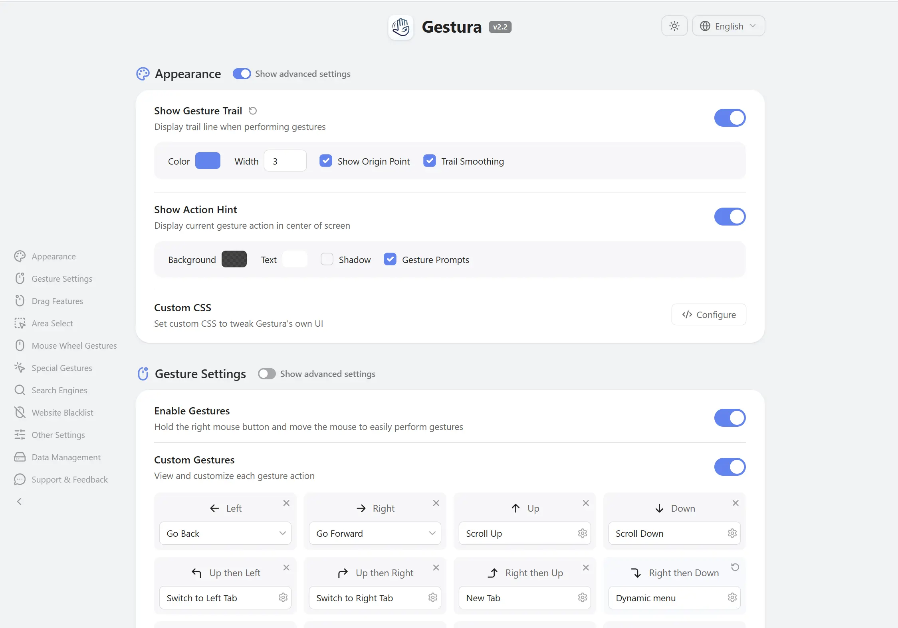

<div align="center">

<h1> Gestura</h1>

[](https://github.com/PPP01/Gestura)
[](https://github.com/PPP01/Gestura/releases)
[](https://github.com/PPP01/Gestura/blob/main/LICENSE)

**English** · [Deutsch](README.de.md)

Gestura is an open-source extension that turns quick mouse movements into browser commands — draw a gesture, drag a link or some text, flick the wheel, and the action happens right away, no keyboard needed.

Gesture navigation, smart per-site **website menus**, super drag, area selection, wheel and rocker gestures, and command chains — all of it is yours to customize.
</div>

> ### 🙏 Gestura is a fork of [FlowMouse](https://github.com/Hmily-LCG/FlowMouse)
>
> **First and foremost: Gestura would not exist without [FlowMouse](https://github.com/Hmily-LCG/FlowMouse) by Hmily\[LCG] & Coxxs.** Gestura is a friendly fork that exists **only** to carry a handful of extra features — smart per-site website menus, configurable search engines, image search, and per-link JS transforms — that didn't make it into FlowMouse (its authors intentionally want to keep it lightweight).
>
> **Huge, heartfelt thanks to the original authors for building such a great extension.** If you don't need the extra features, please use and support the original: **[FlowMouse](https://github.com/Hmily-LCG/FlowMouse)**. Gestura remains open source under the same GPL-3.0 license.

<div align="center">
<br>

</div>

## Install

Store listings are in preparation. In the meantime you can install from source or from the release artifacts:

> Download from [GitHub Releases](https://github.com/PPP01/Gestura/releases) and load it manually, or clone the repo and load it as an unpacked extension (`chrome://extensions` → Developer mode → *Load unpacked*).

## Features

With Gestura, the mouse you already hold becomes a shortcut for almost everything you do while browsing: switching tabs, going back and forward, searching selected text, opening links in batches, and more — each mapped to a movement you choose.

### Everything FlowMouse does

Gestura ships the **complete FlowMouse feature set** — nothing removed:

- **Custom gestures** — 16 built-in gestures, plus unlimited custom ones you define yourself.
- **Super drag** — drag text, links, or images to trigger an action instantly.
- **Wheel gestures** — hold the right mouse button and scroll to switch tabs.
- **Rocker gestures** — hold one mouse button and click the other to go back/forward.
- **Area select** — Shift + Drag to open or copy many links at once.
- **Command chains** — run several actions from a single gesture.
- **Visual settings & tutorial** — customize the gesture trail, action hints, and more from a clean UI; interactive guide on first install.

### ✨ What Gestura adds

The reason Gestura exists — the extra features that didn't make it into FlowMouse:

- **Website menus — Gestura's headline feature.** Ready-made, fully editable popup menus for the sites you use every day: GitHub, YouTube, Amazon (with country selection), Gmail, Google Maps, Microsoft 365, Facebook, Reddit, Wikipedia, your own Home Assistant, and more — every entry with a fitting icon. One contextual gesture opens the right menu on whatever site you're on; a default **Search** menu (Google, Brave, Perplexity, DuckDuckGo …) covers everything else, and a **Shopping** menu (Amazon, eBay, …) searches your selection where you buy.
- **Menus that stay yours** — edit any predefined menu globally, or load one into a single gesture as a customized copy that keeps inheriting future improvements for the entries you didn't touch. Private per-gesture menus, an optional quick-search bar appended to every menu, per-menu switcher visibility, and configurable link opening (same tab, or a new tab left/right/first/last) — globally and per menu.
- **Configurable search engines** — add, reorder, and hide your own text **and** image search engines, with sensible per-locale defaults; register the current site to a menu with a single swipe.
- **Image search** — drag or invoke a reverse-image search on the engines you choose.
- **Per-link JavaScript transforms** — reshape the selected text with a small, sandboxed JS snippet before it is handed to a search URL (advanced, runs isolated from the page and the extension).
- **Export and import show you the whole thing first** — both display the complete content before anything is written and check it against a real schema: entries Gestura does not know are listed and dropped instead of written, values with the wrong shape fall back to their default, and a file cannot smuggle in a switch, a consent or a sync code.
- **Browser sync is a switch** — leave it on (the default) and nothing changes. Turn it off and the settings live on this device only, with room to grow to 1 MiB in total instead of 8192 bytes per section. When a save no longer fits, Gestura names the section and the numbers and offers the ways out.
- **Repeated gestures** — `↓↓`, `→→`, `↑↑`, `←←` and longer ones like `↓↓→`, drawn as a long stroke or as stroke, pause, stroke. Unbound repeats fall back to the plain gesture, so nothing changes until you use them.

### Optional: gestura.eu

Two switches, **both off by default**, each behind its own consent. With them off Gestura is fully standalone and talks to no server at all — including gestura.eu.

- **Website integration** — lets pages on gestura.eu hand over a ready-made menu or search engine (always with your click and a preview), ask which of their entries you have installed, and tell you when a newer version of one exists. Only ids and version numbers are ever sent, and only for entries you imported from that origin.
- **Sync between browsers** — save your settings as named states on gestura.eu and open them in another browser. End-to-end encrypted under a code this browser generates and never sends: the service stores ciphertext, its size and its date, and never sees a key, a state's name, or a single setting.
- **Reconciling two browsers** — a **Sync** button on every state merges it with this browser against what the two last agreed on. Changes made on one side alone are taken over without a question, a deletion stays deleted instead of being resurrected by the other side's copy, and only an entry both sides changed asks you: keep mine, take theirs, or keep both. No clock decides anything, and two browsers racing each other cannot lose a write.

## Default Gestures

All gestures can be customized in the options page.

| Gesture | Function | Gesture | Function |
|:---:|:---|:---:|:---|
| `←` | Back | `→` | Forward |
| `↑` | Scroll Up | `↓` | Scroll Down |
| `↑←` | Switch to Left Tab | `↑→` | Switch to Right Tab |
| `→↑` | New Tab | `→↓` | Reload Current Page |
| `↓←` | Stop Loading | `↓→` | Close Current Tab |
| `←↑` | Reopen Closed Tab | `←↓` | Close All Tabs |
| `↑↓` | Scroll to Bottom | `↓↑` | Scroll to Top |
| `←→` | Close Current Tab | `→←` | Reopen Closed Tab |

## For site operators

A website can hand a ready-made Gestura menu or search engine to the extension.
Nothing is imported silently: every hand-off requires a real user click, the
payload is validated against the exchange format, and the user confirms it in a
preview dialog. Search engines that carry a transform script need a separate,
explicit acknowledgement.

**Only gestura.eu can hand over anything today.** Both mechanisms below are
gated on the page's own origin: they work on `gestura.eu` and on the single
developer origin a user may configure, and nowhere else. Opening the interface to
third-party sites is planned as its own opt-in with its own warning; until that
switch exists, treat this section as documentation of the format rather than an
interface you can use on your own domain.

**And the user has to opt in first.** Hand-offs only work while the user has
enabled *gestura.eu integration* in Gestura's settings — it is off by default.
While it is off, or on any other origin, Gestura ignores the click entirely: a
`rel="gestura-menu"` link is simply followed by the browser (so point it at a URL
that makes sense to open), and an inline button does nothing Gestura-related (so
offer a plain download as fallback). Gestura does not tell your page whether the
integration is on.

**By link, for JSON you host yourself.** The link's `href` must be same-origin
with the page. The extension follows redirects when it fetches that URL, so a
same-origin link can end up served from another origin; provenance is judged by
the final URL, not the one written in the link.

```html
<a rel="gestura-menu" href="/gestura-menu.json">Add to Gestura</a>
```

**Inline, for data that lives on another origin.** A trusted click on an element
carrying `data-gestura-inline` opens a 15-second hand-off window. Put the
attribute on the button itself, not on a wrapping container — a click on any
descendant has its default action suppressed, so a card- or row-level attribute
silently breaks every link inside it. Fetch the data yourself — you are subject
to the usual CORS rules, the extension is not involved — and dispatch it as a
**string**:

```html
<button data-gestura-inline>Add to Gestura</button>
<script>
document.querySelector('[data-gestura-inline]').addEventListener('click', async () => {
	const res = await fetch('https://api.example.com/bundle', { /* … */ });
	document.dispatchEvent(new CustomEvent('gestura:import', {
		detail: JSON.stringify(await res.json()),
	}));
});
</script>
```

The window accepts exactly one payload and closes on the first one. On this path
the extension performs no request of its own.

**Payload formats.** A single `gesturaMenu` or `gesturaEngine` object, or a bundle
of them:

```json
{ "gesturaBundle": 1, "entries": [ { "gesturaMenu": 1, "…": "…" } ] }
```

Limits: 100 KB per entry, 1 MB per bundle, 200 entries — those are the hand-off
limits; what actually fits also depends on the browser's sync storage quota.

**Menus that use your own search engine must ship it too.** A menu item may point
at a search engine by `engineId` instead of carrying a URL. That is ideal for the
engines Gestura already bundles — they cost nothing and follow the user's own
settings. But an `engineId` naming an engine the user does not have cannot
resolve, so the extension refuses to import that menu and says which engine is
missing. Put the `gesturaEngine` in the same bundle as the menu that needs it.
Every URL inside an entry must be `https:`. The full contract is
`js/exchange-schema.json`; the runtime validator in `js/menu-exchange.js` is
authoritative.

## Privacy

Gestura is an open source extension. The code is hosted on GitHub and open to review and contribution.

- Gestura **does not collect** any browsing history, bookmarks, or usage habits.
- Gestura **does not contain** any analytics or advertising code.
- Gestura **contacts no server at all** in its default configuration. The two gestura.eu switches are off until you turn them on, each behind its own consent.
- Gestura **uploads nothing you did not click**. With gestura.eu sync switched on, the settings you choose to save travel as ciphertext only — encrypted in your browser under a key derived from a code that never leaves it.

Gestura settings are stored locally via the browser's storage API. Browser sync is a switch in the settings' data section. Left on — the default — the browser encrypts and syncs them across your signed-in devices, entirely under its own privacy and sync settings. Turned off, they stay in this device's local storage and never leave it; the copy already in the browser's sync area is left in place, not deleted.

### A note on Brave

**Brave does not sync extension settings across devices, even when Brave Sync is enabled.** This is a limitation of Brave itself, not of Gestura. Brave runs its own self-hosted sync infrastructure (Brave Sync v2) that deliberately covers only a subset of the browser's data types — bookmarks, history, passwords, open tabs, the list of installed extensions, and so on. The *extension settings* data type (the storage area Gestura uses via `chrome.storage.sync`) is not included, and there is no API an extension could use to opt into it.

Your settings are still saved and preserved on each Brave device — they are simply not carried over to your other devices automatically. Two ways around it, both on the options page: **Export** and **Import** move the configuration as a file, and **gestura.eu sync** — off by default, behind its own consent — saves it as a named state you can open in the other browser and afterwards reconcile with a single click.

See [PRIVACY.md](PRIVACY.md) for the full privacy policy.

## Changelog

See [CHANGELOG.md](https://github.com/PPP01/Gestura/blob/main/CHANGELOG.md).


---

**Gestura · Smoother browsing, effortless control.**

---

### Credits & Author Information

- **Gestura maintainer**: PPP01 — [contact@gestura.eu](mailto:contact@gestura.eu)
- **Gestura GitHub**: [https://github.com/PPP01/Gestura](https://github.com/PPP01/Gestura)
- **Based on FlowMouse by**: Hmily [LCG] & Coxxs — [https://github.com/Hmily-LCG/FlowMouse](https://github.com/Hmily-LCG/FlowMouse)
- **License**: GPL-3.0 (same as the original). Gestura is a modified version of FlowMouse; see [LICENSE](LICENSE) and [NOTICE](NOTICE).
- Feedback and suggestions are welcomed.
